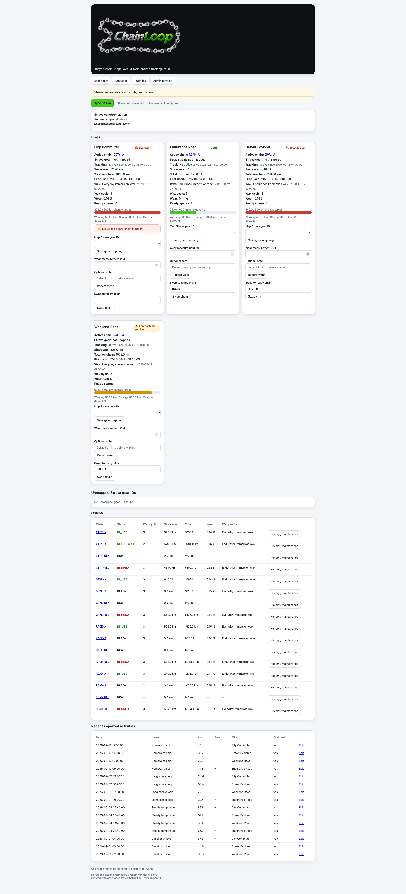
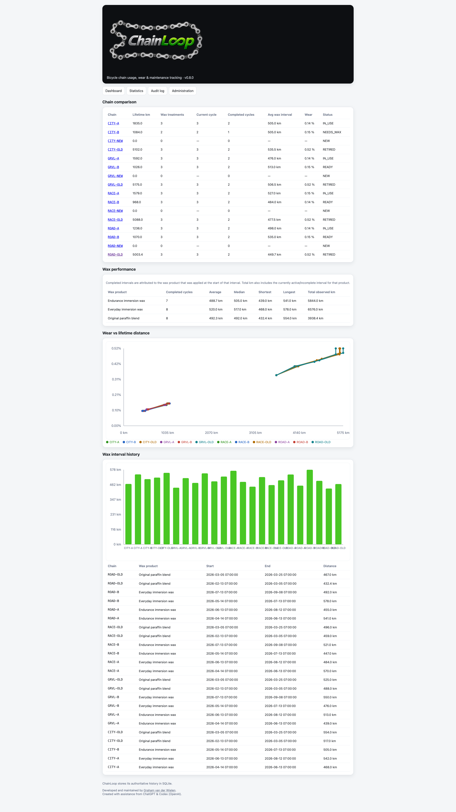

<p align="center">
  
</p>

# ChainLoop

**ChainLoop** is a self-hosted bicycle-chain usage, wear and maintenance tracker.
SQLite is the authoritative datastore; Strava supplies rides, Pushover supplies maintenance alerts,
and Home Assistant can consume the read-only API.

## Deployment security

**ChainLoop does not provide built-in authentication or authorization. It is designed
for private/internal deployment behind an authenticated reverse proxy, VPN, or
equivalent access-control layer. Do not expose ChainLoop directly to the public Internet.**

Anyone who can reach ChainLoop can read application data and perform administrative
and maintenance actions. Operators must enforce external access policy and prevent
backend access that bypasses it. ChainLoop does not consume proxy identity headers.
The preferred Docker/Traefik example does not publish the application port.

Read [SECURITY.md](SECURITY.md) for the trust boundary, required configuration,
CSRF/session behavior, TLS responsibilities and explicit local HTTP development mode.

## Current release: v0.8.0

v0.8.0 is the reliability, migration and security release:

- automated tests use disposable SQLite databases with guards against installation data;
- historical activity corrections preserve the correct physical chain and wax cycle,
  including eligible rides on retired chains;
- READY spare checks consistently require recorded wax, and recording missing initial
  wax preserves existing distance;
- controlled startup migrations maintain an append-only schema ledger, safely adopt
  supported pre-ledger databases and refuse newer or inconsistent schemas;
- browser CSRF, signed sessions, secure cookies, Host/canonical URL validation,
  OAuth correlation, CSP/security headers and health/error redaction;
- bounded input and Strava payload validation, restricted outbound HTTPS integrations
  and a hardened non-root container.

**Operator action required:** the container now runs as UID/GID `10001:10001`.
Existing root-owned data may need a one-time ownership correction after backup
and shutdown. Follow [the v0.7.x → v0.8.0 upgrade instructions](UPGRADE.md#v07x---v080).
Review the runtime hardening settings in your local Compose file as well.

Existing databases are preserved and upgraded additively. External authentication
and access control remain the operator's responsibility; v0.8.0 must not be
exposed directly to the public Internet.

## Core features

### Pushover maintenance notifications

Threshold alerts are deduplicated **per physical chain and per wax cycle**:

- `⚠️ 500 km` — approaching service
- `🔧 600 km` — chain change due
- `⛔️ 800 km` — overdue

A successful alert is sent only once for that wax cycle. A new wax event naturally starts a new notification cycle.
Failed Pushover deliveries are not marked complete, so ChainLoop can retry on a later ride.

If a chain is already change-due and there is no `READY` spare chain, ChainLoop can also send a separate no-ready-spare warning.

### Automatic Strava sync

Automatic sync is built in and remains backward-compatible with one daily time:

```dotenv
STRAVA_AUTO_SYNC=true
STRAVA_SYNC_TIME=21:00
STRAVA_SYNC_TIMES=
CHAINLOOP_TIMEZONE=Europe/Amsterdam
```

You can instead configure multiple daily runs:

```dotenv
STRAVA_SYNC_TIMES=07:00,13:00,21:00
```

When `STRAVA_SYNC_TIMES` is set it takes precedence over `STRAVA_SYNC_TIME`. Manual **Sync Strava** remains available.

ChainLoop stores sync runs including:

- trigger (`manual` or `scheduled`);
- start/completion time;
- success/failure;
- new activities imported;
- activities counted;
- km added;
- last error.

The dashboard shows the last successful sync and latest result/error.

### Maintenance workflow

The supported physical-chain states are:

```text
NEW
IN_USE
READY
NEEDS_WAX
RETIRED
```

The intended workflow is:

```text
ride
 -> threshold alert
 -> measure wear (recommended before re-waxing)
 -> swap to a READY chain
 -> removed chain becomes NEEDS_WAX
 -> record wax
 -> chain becomes READY
```

When waxing a `NEEDS_WAX` chain, ChainLoop warns if no wear measurement has been recorded during the current wax cycle.
The warning is advisory: you can explicitly continue without measuring.

Chains can be retired after they are removed from the bike. Retirement records final wear, timestamp, reason and an optional note while preserving lifetime history.

A newly prepared chain's first recorded hot-wax treatment starts **wax cycle 1**. `NEW` means the chain is not yet prepared. `READY` means it has at least one recorded wax treatment and is available to install.

### History and statistics

Each physical chain has a history/maintenance page with:

- first-use date;
- lifetime km;
- current km since wax;
- current wear;
- wax history and products;
- wear measurement history;
- installation/removal events;
- rides attributed to the chain;
- manual corrections;
- audit events.

The Statistics page includes:

- chain comparison table;
- completed wax-cycle statistics per wax product;
- wax interval graph;
- wear percentage vs lifetime-km graph.

### Corrections and data integrity

The activity correction screen supports:

- correcting the bike;
- selecting the physical chain to credit;
- correcting distance;
- excluding a ride;
- adding a required correction reason.

If an activity was already counted, ChainLoop reverses the previous accounting first and then applies the corrected state.
Historical corrections update the appropriate historical wax interval instead of incorrectly changing the live `km_since_wax` counter.
Corrections do not emit retroactive Pushover threshold alerts.

Duplicate activities are protected both in application logic and by a SQLite unique index on `(source, external_id)`.

## Fresh installation

A new v0.8.0 database starts empty. After ChainLoop is running, open **Administration** and create, in order:

1. rider;
2. chain specification;
3. bike;
4. wax product(s);
5. physical chains.

For chains that are already hot-waxed and ready, choose **Already waxed and ready** and provide the real wax product/date. That creates wax cycle 1 immediately.

### 1. Create local configuration files

The repository intentionally does **not** track your real `.env`, `docker-compose.yaml`, or `data/` directory.

```bash
cp .env.example .env
cp docker-compose.yaml.example docker-compose.yaml
```

Edit both files for your deployment. Generate the required session secret with:

```bash
python -c 'import secrets; print(secrets.token_urlsafe(32))'
```

Set `SESSION_SECRET` to the generated value. `APP_BASE_URL` must be the canonical
external HTTPS origin; a matching explicit `STRAVA_REDIRECT_URI` remains supported.
Configure external access control before starting the production deployment.

Do not commit `.env`, `docker-compose.yaml`, or the contents of `data/`.

The container runs as fixed UID/GID `10001:10001`. On Linux, create the exact
bind-mounted `data/` directory with ownership that permits this user to create and
update the SQLite database and its WAL/SHM files. Existing installations must
follow the backup, stop, narrowly scoped ownership migration and verification
steps in [`UPGRADE.md`](UPGRADE.md); never recursively change ownership on a broad
parent directory.

### 2. Configure Strava

Open **Strava API Settings**:

https://www.strava.com/settings/api

Create/configure a Strava application and set the **Authorization Callback Domain** to the hostname used for ChainLoop.
For example, if ChainLoop runs at:

```text
https://chainloop.example.com
```

use:

```text
Authorization Callback Domain: chainloop.example.com
```

and set in `.env`:

```dotenv
CHAINLOOP_HOST=chainloop.example.com
APP_BASE_URL=https://chainloop.example.com
STRAVA_REDIRECT_URI=https://chainloop.example.com/auth/strava/callback
```

Then provide your own Strava client ID and client secret.

### 3. Configure Pushover

Set your Pushover application token and user key in `.env`:

```dotenv
PUSHOVER_APP_TOKEN=...
PUSHOVER_USER_KEY=...
```

### 4. Validate and start

```bash
docker compose config --quiet
docker compose build
docker compose up -d
docker compose ps
```

Verify the application from inside the container:

```bash
docker compose exec -T chainloop python - <<'PY'
import urllib.request
print(urllib.request.urlopen(
    "http://127.0.0.1:8080/health"
).read().decode())
PY
```

Expected version:

```text
0.8.0
```

## Example `.env`

See `.env.example`. Typical values look like:

```dotenv
CHAINLOOP_HOST=chainloop.example.com
APP_BASE_URL=https://chainloop.example.com
DATABASE_URL=sqlite:////data/chainloop.db
SESSION_SECRET=<generated-random-secret>
CHAINLOOP_ALLOWED_HOSTS=127.0.0.1,localhost
CHAINLOOP_DEV_ALLOW_HTTP=false

STRAVA_CLIENT_ID=
STRAVA_CLIENT_SECRET=
STRAVA_REDIRECT_URI=https://chainloop.example.com/auth/strava/callback
STRAVA_SCOPES=activity:read_all
STRAVA_API_BASE_URL=https://www.strava.com/api/v3
STRAVA_VERIFY_TOKEN=replace-with-a-random-secret
STRAVA_AUTO_SYNC=true
STRAVA_SYNC_TIME=21:00
STRAVA_SYNC_TIMES=
CHAINLOOP_TIMEZONE=Europe/Amsterdam

PUSHOVER_APP_TOKEN=
PUSHOVER_USER_KEY=
```

## Docker / Traefik

`docker-compose.yaml.example` demonstrates a Traefik deployment using an external `traefik` Docker network.
Port 8080 is not published on the host; Traefik talks directly to `chainloop:8080`.

If your Docker network, certificate resolver or reverse proxy differs, edit your local `docker-compose.yaml` accordingly.
The example's TLS router is not an access policy: attach your own authentication
middleware or equivalent VPN/firewall policy and restrict backend network membership.
TLS/HSTS and targeted rate limits belong at the reverse proxy.

## Upgrading an existing installation

Follow [`UPGRADE.md`](UPGRADE.md) for the full v0.7.x → v0.8.0 procedure,
including backup, shutdown, data ownership, configuration review and verification.
Preserve your `.env`, local `docker-compose.yaml` and `data/`; do not overwrite
them with the public examples.

ChainLoop runs ordered, additive database migrations during controlled application
startup. Existing pre-ledger databases are validated before adoption, and the
application refuses to start if the database was migrated by a newer ChainLoop
version or cannot be classified safely. Migrations do not reset existing chain
totals, Strava OAuth data, wax history or processed rides. Existing READY chains
without wax history are intentionally flagged for an explicit initial-wax record.

## API

Existing read-only API endpoints remain available through your deployment's external
access policy. Home Assistant must use that policy too; it receives no automatic bypass.
`/health` returns only `status`, `app` and `version` (503 if its database check fails).
Interactive API documentation is disabled. Useful endpoints include:

```text
GET /health
GET /api/bikes
GET /api/activities/recent
GET /api/history/{chain_id}
```

## Development tests

Use Python 3.13, matching the Docker image. Install the test-only dependencies and run the suite:

```bash
python -m pip install -r requirements-dev.txt
python -m pytest
```

The test harness permits only in-memory SQLite databases or database files
inside its disposable pytest directory. Importing the application during a
test fails before opening a database if `DATABASE_URL` resolves elsewhere.
Importing application modules never creates or migrates a database; database
initialization is an application-startup operation.

## Branding

| Asset | Purpose |
|---|---|
| `app/static/branding/chainloop-logo-dark.png` | Main logo / README |
| `app/static/branding/chainloop-icon-source.png` | Full-resolution app icon |
| `app/static/branding/chainloop-icon-128.png` | Pushover/app icon |
| `app/static/branding/chainloop-icon-512.png` | Large app icon |
| `app/static/branding/chainloop-strava-124.png` | 124×124 Strava application icon |
| `app/static/branding/chainloop-favicon-source.png` | Full-resolution infinity favicon source |
| `app/static/favicon.ico` | Infinity-only browser favicon |
| `app/static/favicon.png` | Infinity-only PNG favicon |

## Screenshots

### Dashboard


### Statistics


### Audit log


### Administration


## Backups

The authoritative SQLite database is stored under `./data/` by default.
Back up that directory together with the rest of your ChainLoop deployment using
your normal backup system. The SQLite database, journal/WAL/SHM files and backups
are sensitive: they may contain Strava OAuth tokens and private rider, activity
and maintenance history. Protect them as credentials.

## Roadmap

See [ROADMAP.md](ROADMAP.md).

Developed and maintained by **[Graham van der Wielen](https://grahamofthewheels.com/)**.
Created with assistance from **ChatGPT & Codex (OpenAI)**.
